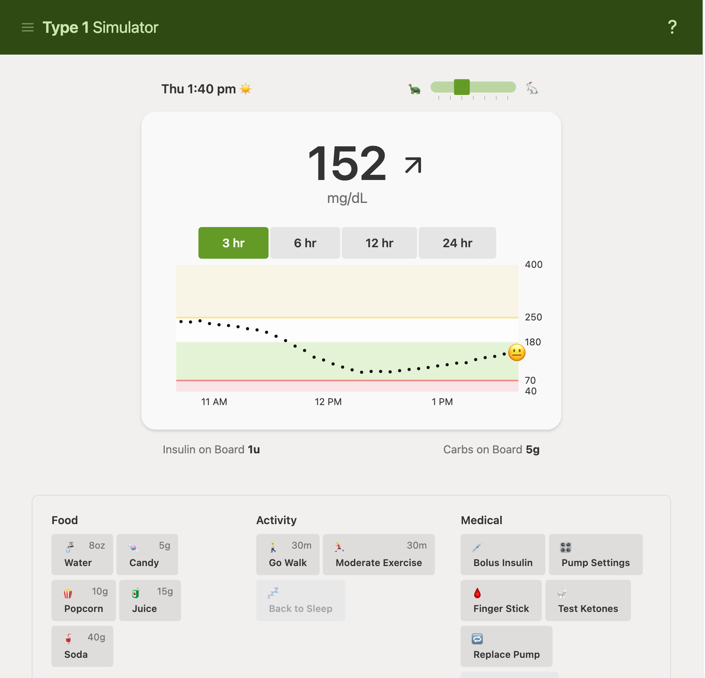

# T1D Simulator



This is a simulation intended for an academic and educational setting, to help give a rough idea of the challenges and decisions that people with Type 1 diabetes face each day.

The program currently simulates a manual insulin pump and a Dexcom CGM, attempting to approximate the insulin sensitivity of a 7-8 year old. The simulation accounts for things like sickness, pump expiration, sensor errors, compression lows and changes, exercise and drinking water. Different meal options are presented.

The simulation of ketones does not currently account for starvation ketones, or the fact that ketones can build up if the person doesn't have enough insulin in their system, even if their blood sugar is low or in range.

### Demo

TBD

### Running locally

Git clone the repo locally, and then:

```sh
yarn
yarn start
```

You'll be able to see the simulation running at http://localhost:8080.

### Disclaimer

This simulation of Type 1 diabetes is for academic purposes only. Do not use for dosing decisions or as medical advice.

People with Type 1 have different treatment requirements and use different devices and approaches to manage their condition. If you have questions about management of your Type 1, talk to a medical professional.

You agree to not hold the authors of this software liable for any claim, damages, or other liability in connection to the use of this software.
